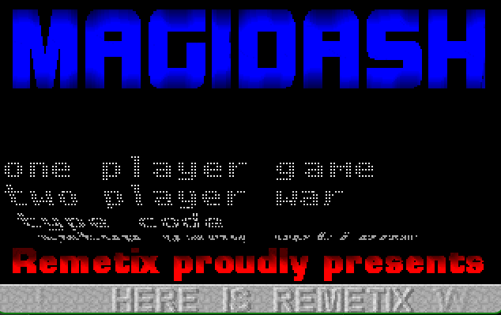

# magidash

DOS game I wrote in 1995

## How to run

Use DosBox to run the game.  The game is in the `release` folder. 

If you are unfamiliar with DosBox: 
* mount the folder where the game is located to (for example )the C drive, 
* switch to that drive.
* run the game (executable name: magidash.exe). You can enable cheats (recommended) with the `magic` command line argument.
 
```bash
mount c /path/to/magidash/release
c:
magidash magic
```

By default DosBox is emulating a CPU which is slightly slower than what I had 1995. As a result the game might be a bit slow, you can speed it up by pressing `CTRL-F12` to increase the cycles. Around 15k cycles should be enough.

## Controls

|         | Player 1     | Player 2  |
|---------|--------------|-----------|
| Left    | numpad 1     | D         |
| Right   | numpad 3     | G         |
| Up      | numpad 5     | R         |
| Down    | numpad 2     | F         |
| Action  | right shift  | tab       |
| Kill    | up + F10     | up + F1   |

In two player mode, if you are dead, you can respawn by pressing the action key. Before you do that you might want to check out your respawn location, as it might be dangerous:
* press right + left to move the camera to the respawn location
* press up + down to create a safety wall around the respawn location (costs 100 points)

Controls can be changed, but because of the way the game reads the keyboard, it is not recommended; especially for two player mode. I don't remember the details, but it's something to do with handling several keys pushed at the same time.

## Cheat mode

Best to start with cheats enabled. (`magic` command line argument)

This activates a few keyboard combinations:
* F1 + F5 + F10: next level
* F3 + F4: restart level
* B + F5 + F1: previous level
* P + A + S: give both players 5 lives
* F6 + 0: Player 1 gets an extra figure to control (at starting location)
* F6 + 2: Player 2 gets an extra figure to control (at starting location)

# Screenshots




